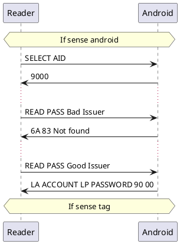

# Nfc door lock

TODO 
- How to distinguish android from tag

# TOTP example

```
otpauth://TYPE/LABEL?PARAMETERS

type = hotp | totp

label = acoountname | issuer ( ":" | "%3A") * "%20" accountname

pareameter =
    issuer
    secret - Base32 (no padding)

```


# Android key process

